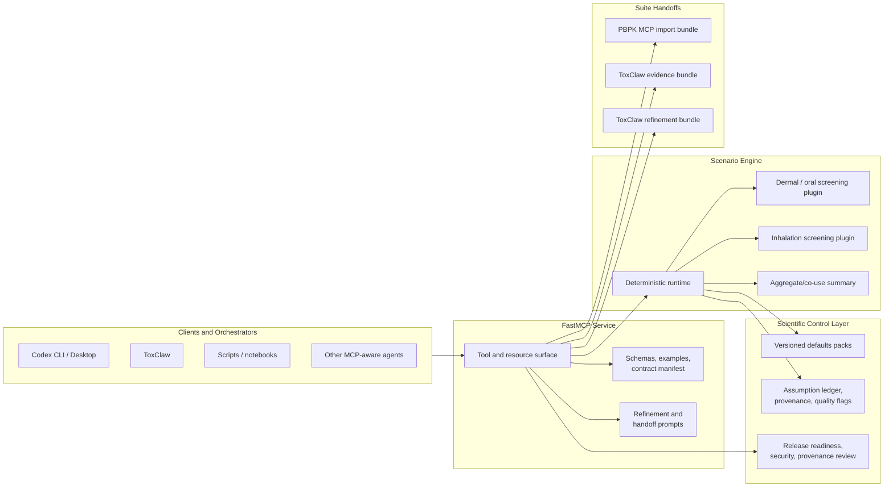

# Exposure Scenario MCP

[](https://github.com/ToxMCP/expossure-scenario-mcp/actions/workflows/ci.yml)
[](./LICENSE)
[](https://www.python.org/)

> Part of **ToxMCP** Suite

**Public MCP server for deterministic external exposure scenario construction in exposure-led NGRA workflows.**
It turns product-use assumptions into auditable dermal, oral, inhalation, and aggregate
external-dose scenarios, then exports ToxClaw-ready evidence objects and PBPK-ready
handoff payloads without taking over PBPK execution, WoE synthesis, BER, PoD derivation,
or final risk decisions.

## Architecture



The design is intentionally narrow:

- `Exposure Scenario MCP` owns external-dose construction only.
- `PBPK MCP` owns kinetic translation and internal-dose interpretation.
- `ToxClaw` owns evidence orchestration, review flow, and NGRA-facing report synthesis.
- Defaults, assumptions, provenance, and limitations are first-class outputs, not hidden internals.

## What's in v0.1.0

- Deterministic dermal and oral screening scenario construction
- Deterministic inhalation screening with room-volume and ventilation semantics
- Tier A uncertainty registers, deterministic sensitivity ranking, and dependency metadata
- Tier B deterministic scenario envelopes from named archetypes
- Packaged Tier B archetype-library sets for governed envelope construction
- Tier B deterministic parameter-bounds propagation without probabilistic overclaiming
- Packaged Tier C single-driver probability-bounds profiles with curated driver taxonomy
- Packaged Tier C coupled-driver scenario-package probability profiles with curated package taxonomy
- Machine-actionable Tier 1 inhalation upgrade advisories for spray scenarios
- Packaged Tier 1 inhalation airflow, particle, and product-family screening profiles
- Simple additive aggregate exposure summaries
- Scenario comparison and refinement deltas
- ToxClaw evidence export and refinement-bundle export
- PBPK scenario export plus exact external-import payload packaging
- Published JSON schemas, examples, contract manifest, and release metadata
- Release-readiness, result-status, troubleshooting, and provenance resources
- Assumption-level evidence/applicability governance and explicit Tier-0 interpretation bounds

## Why this project exists

Exposure information is often the weakest structured input in early NGRA orchestration:
there may be CompTox context, product-use hints in prompts, or local refinement notes,
but not a stable, auditable external-dose object that downstream systems can trust.

Exposure Scenario MCP gives the suite a dedicated exposure layer that is:

- **deterministic-first** for transparent screening use
- **MCP-native** with typed tools, resources, prompts, schemas, and examples
- **auditable** through assumption records, defaults versioning, provenance, and quality flags
- **bounded** so it complements PBPK and ToxClaw instead of overlapping them

## Feature snapshot

| Capability | Description |
| --- | --- |
| `Screening scenarios` | Builds route-specific external-dose scenarios for dermal, oral, and inhalation screening use cases. |
| `Tier A uncertainty diagnostics` | Publishes qualitative uncertainty registers, one-at-a-time sensitivity ranking, dependency metadata, and validation posture on each scenario. |
| `Tier B deterministic envelopes` | Builds named archetype envelopes with bounded min/median/max outputs and explicit driver attribution without probabilistic overclaiming. |
| `Tier B archetype library` | Publishes governed packaged archetype sets and instantiates them into deterministic envelopes with set/version provenance. |
| `Tier B parameter bounds` | Propagates explicit lower and upper parameter bounds through a deterministic scenario to produce min/max ranges, monotonicity checks, and bounded uncertainty records. |
| `Tier C probability bounds` | Publishes packaged single-driver probability-bounds profiles with curated driver taxonomy and evaluates their support points without Monte Carlo or joint-distribution claims. |
| `Tier C scenario packages` | Publishes dependency-aware packaged scenario states with cumulative probability bounds, curated package taxonomy, and preserved coupled drivers without Monte Carlo claims. |
| `Tier 1 inhalation screening` | Publishes machine-actionable upgrade advisories for spray inhalation scenarios, preserves the `requestedTier` routing hook on Tier 0 requests, ships a deterministic Tier 1 NF/FF screening tool, exposes packaged airflow, particle, and product-family screening profiles through a machine-readable manifest, and warns when caller geometry or regime inputs diverge materially from matched profile anchors. |
| `Aggregate summaries` | Produces additive co-use summaries while preserving route and component transparency. |
| `PBPK handoff export` | Emits PBPK-ready objects plus an exact external-import package aligned to the upstream PBPK MCP request shape. |
| `ToxClaw evidence export` | Emits deterministic evidence, claim, and report-section primitives for ToxClaw consumption. |
| `Refinement workflow support` | Emits comparison/refinement bundles with explicit `refine_exposure` semantics and workflow hooks. |
| `Contract publication` | Publishes schemas, examples, manifest metadata, docs resources, release metadata, and result-status conventions. |
| `Scientific guardrails` | Keeps BER, PoD derivation, PBPK execution, and final risk conclusions outside this server while publishing assumption governance and tier semantics on every scenario. |

## Table of contents

1. [Architecture](#architecture)
2. [What's in v0.1.0](#whats-in-v010)
3. [Why this project exists](#why-this-project-exists)
4. [Feature snapshot](#feature-snapshot)
5. [Tool catalog](#tool-catalog)
6. [Resource catalog](#resource-catalog)
7. [Quick start](#quick-start)
8. [Release verification](#release-verification)
9. [Repository layout](#repository-layout)
10. [Current limitations](#current-limitations)
11. [Scientific boundaries](#scientific-boundaries)
12. [Contributing](#contributing)
13. [Code of conduct](#code-of-conduct)
14. [License](#license)

## Tool catalog

### Scenario construction

- `exposure_build_screening_exposure_scenario`
- `exposure_build_exposure_envelope`
- `exposure_build_exposure_envelope_from_library`
- `exposure_build_parameter_bounds_summary`
- `exposure_build_probability_bounds_from_profile`
- `exposure_build_probability_bounds_from_scenario_package`
- `exposure_build_inhalation_screening_scenario`
- `exposure_build_inhalation_tier1_screening_scenario`
- `exposure_build_aggregate_exposure_scenario`
- `exposure_compare_exposure_scenarios`

### Handoff export

- `exposure_export_pbpk_scenario_input`
- `exposure_export_pbpk_external_import_bundle`
- `exposure_export_toxclaw_evidence_bundle`
- `exposure_export_toxclaw_refinement_bundle`

## Resource catalog

### Contracts and examples

- `contracts://manifest`
- `schemas://{schema_name}`
- `examples://{example_name}`
- `defaults://manifest`
- `tier1-inhalation://manifest`
- `archetypes://manifest`
- `probability-bounds://manifest`
- `scenario-probability://manifest`
- `benchmarks://manifest`
- `validation://manifest`

### Operator and scientific documentation

- `docs://algorithm-notes`
- `docs://archetype-library-guide`
- `docs://probability-bounds-guide`
- `docs://tier1-inhalation-parameter-guide`
- `docs://inhalation-tier-upgrade-guide`
- `docs://defaults-evidence-map`
- `docs://operator-guide`
- `docs://provenance-policy`
- `docs://result-status-semantics`
- `docs://uncertainty-framework`
- `docs://validation-framework`
- `docs://suite-integration-guide`
- `docs://troubleshooting`

### Release and review artifacts

- `docs://release-notes`
- `docs://conformance-report`
- `docs://release-readiness`
- `docs://security-provenance-review`
- `release://metadata-report`
- `release://readiness-report`
- `release://security-provenance-review-report`

## Prompt catalog

- `exposure_refinement_playbook`
- `exposure_pbpk_handoff_checklist`

## Quick start

```bash
git clone https://github.com/ToxMCP/expossure-scenario-mcp.git
cd expossure-scenario-mcp

uv sync --extra dev
uv run generate-exposure-contracts
uv run pytest
uv run exposure-scenario-mcp --transport stdio
```

Run over Streamable HTTP:

```bash
uv run exposure-scenario-mcp --transport streamable-http
```

## Release verification

```bash
uv run ruff check .
uv run pytest
uv build
uv run generate-exposure-contracts
uv run check-exposure-release-artifacts
```

Current published package version: `0.1.0`

## Repository layout

- `src/exposure_scenario_mcp/` - server, models, runtime, defaults, provenance, integrations
- `defaults/` - versioned defaults packs
- `schemas/` - generated schemas and examples
- `docs/contracts/` - published schemas and contract manifest mirrors
- `docs/releases/` - release notes and release metadata
- `docs/` - operator, troubleshooting, provenance, readiness, and suite integration docs
- `evals/` - read-only evaluation bundle
- `tests/` - runtime, contract, integration, and release-artifact tests

## Current limitations

The current `v0.1.0` release is intentionally honest about what it does not do:

- It is deterministic-first and does not ship a probabilistic population engine.
- It does not execute PBPK, estimate internal dose, derive BER or PoD values, or make final risk decisions.
- Some screening factors still resolve from heuristic defaults packs and should be treated as screening-level assumptions.
- Remote `streamable-http` deployment still requires external authentication and origin hardening.
- PBPK request alignment should be re-validated whenever PBPK MCP changes its published contract version.

## Scientific boundaries

Exposure Scenario MCP is the **external-dose construction** layer in the suite.
That means:

- it may infer and default screening inputs
- it may compare and aggregate scenarios
- it may export PBPK- and ToxClaw-facing handoff objects

It does **not**:

- claim toxicokinetic authority
- replace mechanistic or WoE interpretation
- produce final risk judgments
- silently elevate heuristic screening assumptions into decision-ready conclusions

## Contributing

See [CONTRIBUTING.md](./CONTRIBUTING.md) for local setup, quality gates,
contract-generation expectations, and scientific boundary rules for changes.

## Code of conduct

See [CODE_OF_CONDUCT.md](./CODE_OF_CONDUCT.md).

## License

This project is licensed under the [Apache License 2.0](./LICENSE).
